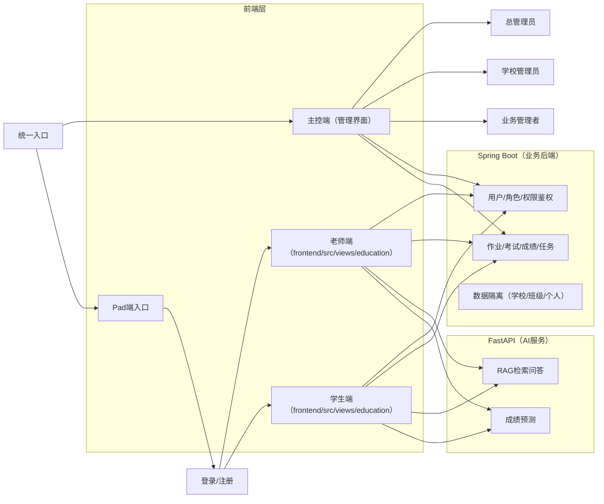
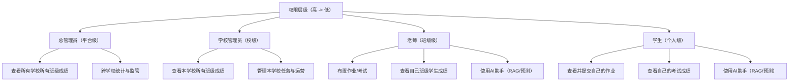

# 融合 RAG 的智能教育平台

本项目是一个三端协同的教育管理系统：
- `backend`：基于若依（Spring Boot）的后台管理与学生成绩 CRUD
- `frontend`：基于 Vue3 + Vite + Element Plus 的前端界面
- `ai_service`：基于 FastAPI 的 RAG 问答与成绩预测服务

目标是把“结构化学生成绩管理”和“非结构化知识问答、模型预测”整合到同一个平台中。

## 首页架构总览

### 技术架构图（主控端 + Pad 端 + 后端 + AI）



### 权限层级图（部门到人员）



## 1. 项目能力

- 学生成绩管理（增删改查、分页）
- Excel 文件上传与向量化入库（RAG 数据集）
- 基于上传数据的问答（ChromaDB + 通义千问）
- 基于 CSV 的学生成绩预测模型训练与推理（TensorFlow）

## 2. 技术栈

- 前端：Vue 3、Vite、Element Plus、Pinia、Axios
- 后端：Spring Boot 2.5.15、MyBatis、PageHelper、Redis、MySQL
- AI 服务：FastAPI、Pandas、ChromaDB、DashScope、TensorFlow、scikit-learn

## 3. 目录结构（核心）

```text
.
├── README.md
├── 整体框架.md
├── backend/                          # Java 后端（聚合工程，含 zhiyu 模块）
│   ├── ruoyi-admin/                  # 启动入口
│   ├── ruoyi-framework/
│   ├── ruoyi-system/
│   ├── ruoyi-common/
│   ├── ruoyi-quartz/
│   ├── ruoyi-generator/
│   └── zhiyu/                        # 学生成绩业务模块（Controller/Service/Mapper）
├── frontend/                         # Vue3 前端
│   ├── src/views/education/          # 教育模块页面
│   ├── src/api/education/            # 教育模块 API
│   └── src/router/education/         # 教育模块路由
└── ai_service/                       # Python RAG/预测服务
    ├── main.py
    ├── rag_service.py
    ├── prediction_service.py
    ├── database.py
    ├── models.py
    ├── data/
    ├── models/
    └── chroma_db/
```

## 4. 关键调用关系

- 前端默认后端 API：`/dev-api/**` -> `http://localhost:8080`
- 前端 RAG API：`/rag-api/**` -> `http://localhost:8000`
- 前端学生管理接口：`/student/performance/**`（走若依后端）
- 前端问答/预测接口：`/rag-api/**`（走 FastAPI 服务）

代理配置见：`frontend/vite.config.js`

## 5. 角色与权限架构

### 5.1 权限矩阵（角色 × 功能）

| 功能 | 总管理员 | 学校管理员 | 业务管理者（主控端） | 老师（Pad） | 学生（Pad） |
|---|---|---|---|---|---|
| 查看所有学校成绩 | ✅ | ❌ | ❌ | ❌ | ❌ |
| 查看本学校所有班级成绩 | ✅ | ✅ | ✅（按授权） | ❌ | ❌ |
| 查看本班学生成绩 | ❌ | ✅（汇总视角） | ✅（按授权） | ✅（仅自己班） | ❌ |
| 查看个人成绩 | ❌ | ❌ | ❌ | ❌ | ✅（仅本人） |
| 创建学生作业任务 | ✅ | ✅ | ✅ | ✅（本班） | ❌ |
| 创建老师任务 | ✅ | ✅ | ✅ | ❌ | ❌ |
| 布置考试 | ✅（策略） | ✅（校级） | ✅（按授权） | ✅（本班） | ❌ |
| Pad端登录/注册后进入业务 | 可进入（协同） | 可进入（协同） | 可进入（协同） | ✅ | ✅ |
| AI助手（RAG/成绩预测） | 可选（通常主控不直接用） | 可选 | 可选 | ✅ | ✅ |

## 6. 核心接口一览

### 6.1 学生成绩（若依后端）

- `GET /student/performance/list`
- `GET /student/performance/{id}`
- `POST /student/performance`
- `PUT /student/performance`
- `DELETE /student/performance/{ids}`

实现位置：
- `backend/zhiyu/src/main/java/com/ruoyi/student/controller/StudentPerformanceController.java`

### 6.2 RAG（FastAPI）

- `POST /upload-excel`
- `GET /query?question=...`
- `GET /rag-api/datasets`
- `GET /rag-api/datasets/{dataset_id}`
- `DELETE /rag-api/datasets/{dataset_id}`

实现位置：
- `ai_service/main.py`
- `ai_service/rag_service.py`

### 6.3 成绩预测（FastAPI）

- `POST /train-prediction-model`
- `POST /predict-score`
- `GET /model-info`

实现位置：
- `ai_service/main.py`
- `ai_service/prediction_service.py`

## 7. 本地启动（建议顺序）

### 7.1 准备依赖

1. MySQL（建议 5.7+/8.0+）
2. Redis（默认 `localhost:6379`）
3. JDK 8 + Maven
4. Node.js（建议 18+）
5. Python（建议 3.9+，Chroma 依赖较新 sqlite3）

### 7.2 初始化数据库

- 创建数据库：`ry-vue`
- 导入若依基础脚本：`backend/sql/ry_20250522.sql`
- 学生成绩权限脚本（可选）：
  - `backend/zhiyu/student_permission_init.sql`
  - `backend/zhiyu/student_permission_assign.sql`

注意：当前仓库未提供 `student_performance` 与 `rag_dataset` 建表 SQL 文件，请按以下代码字段自行建表：
- `backend/zhiyu/src/main/resources/mapper/student/StudentPerformanceMapper.xml`
- `ai_service/models.py`

### 7.3 启动若依后端（8080）

```bash
cd backend
mvn clean install -DskipTests
cd ruoyi-admin
mvn spring-boot:run
```

### 7.4 启动 RAG 服务（8000）

```bash
cd ai_service
uv add fastapi uvicorn chromadb pandas scikit-learn tensorflow sqlalchemy pymysql dashscope joblib
uv run uvicorn main:app --reload --host 0.0.0.0 --port 8000
```

### 7.5 启动前端（80）

```bash
cd frontend
npm install
npm run dev
```

访问：
- 前端：`http://localhost`
- 若依后端：`http://localhost:8080`
- RAG Docs：`http://localhost:8000/docs`

## 8. 环境变量与配置文件

- 前端基础接口：`frontend/.env.development`
- 前端代理：`frontend/vite.config.js`
- 若依后端配置：
  - `backend/ruoyi-admin/src/main/resources/application.yml`
  - `backend/ruoyi-admin/src/main/resources/application-druid.yml`
- RAG MySQL 连接：`ai_service/database.py`
- RAG LLM Key：`ai_service/rag_service.py`

## 9. 已知风险与建议

- `README.md` 原有 git 冲突标记已清理（本次重写）。
- `ai_service/rag_service.py` 目前写死了 DashScope API Key，建议改为环境变量。
- `ai_service/database.py` 当前写死 MySQL 账号密码，建议改为环境变量。
- 前端与后端中部分接口匿名访问，若用于生产建议统一鉴权策略。

## 10. 便于后续检索的关键文件索引

- 前端教育路由：`frontend/src/router/education/index.js`
- 前端教育 API：`frontend/src/api/education/`
- 前端教育页面：`frontend/src/views/education/`
- 学生成绩 Controller：`backend/zhiyu/src/main/java/com/ruoyi/student/controller/StudentPerformanceController.java`
- 学生成绩 Mapper：`backend/zhiyu/src/main/resources/mapper/student/StudentPerformanceMapper.xml`
- RAG 服务入口：`ai_service/main.py`
- RAG 核心逻辑：`ai_service/rag_service.py`
- 预测服务：`ai_service/prediction_service.py`
- RAG 数据模型：`ai_service/models.py`
- RAG 数据库连接：`ai_service/database.py`

---
如果你后面要我继续做“建表 SQL 自动生成”或“一键启动脚本整合”，可直接基于这个 README 往下扩展。
